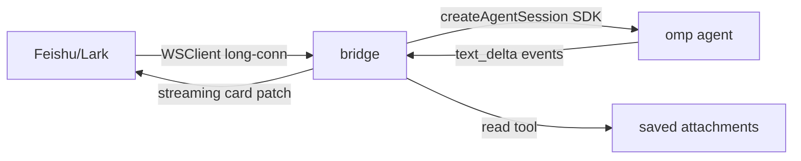

# feishu-omp-bridge

A Feishu/Lark channel for the **omp (Oh My Pi)** terminal coding agent. DM or
@mention a Feishu bot → it drives an omp session → the agent streams its reply
back into the chat.

This is **not** a 1:1 port of OpenClaw's `@openclaw/feishu` plugin or Hermes
Agent's feishu platform (both ~8,000 lines). It is a smaller channel (~2,270
lines) that covers the core messaging surface. The matrix below was
cross-verified against the **actual installed source** of both reference plugins
(`~/.hermes/hermes-agent/plugins/platforms/feishu/`, 8,167 lines;
`/usr/local/lib/node_modules/openclaw/docs/channels/feishu.md`), not just their
public docs.



## What works (implemented + cross-verified)

| Capability | Source verified against | Notes |
|---|---|---|
| Bot DMs + group chats | OpenClaw / Hermes | WSClient long-connection, no public URL |
| Streaming card replies | Hermes `flush`/patch | debounced card edit |
| Receive **images** → omp `ImageAttachment` | Hermes `_download_feishu_image` | base64 to omp |
| Receive **.txt/.md** files | Hermes `_maybe_extract_text_document` | content inlined (<64 KiB, UTF-8) |
| Receive **binary files** (pdf/doc/zip/…) | Hermes saved-attachment model | saved under `dataDir/incoming/`, placeholder + path so omp's `read` tool opens it |
| Receive **audio/video/sticker** | Hermes `_handle_message_event_data` | saved + placeholder |
| Send **images/files/audio/video** | Hermes `send_image/file/voice/video` | native bubbles |
| Rich text **post** parse (inbound→text) + build (outbound) | Hermes `_build_markdown_post_rows` | fenced-code-block isolation |
| `dmPolicy`: allowlist / pairing / open | OpenClaw `dmPolicy` | pairing codes in SQLite |
| `groupPolicy`: open / allowlist / disabled + `requireMention` + per-group overrides | OpenClaw `groupPolicy` | |
| `groupSessionScope`: group / group_sender / group_topic / group_topic_sender | OpenClaw `groupSessionScope` | |
| Admin/user command tier split | Hermes admin/user tiers | |
| Per-chat serialization lock (LRU) | Hermes `_get_chat_lock` | |
| Card-action dedup | Hermes `_is_card_action_duplicate` | |
| Slash commands: `/help /whoami /status /reset /model /sessions /resume` | Hermes command set | tier-gated |
| Per-chat persistent `/model` override | Hermes `/model` | survives restart |
| Delivery ledger (at-least-once redelivery) | Hermes `state.db` ledger | crash-recovery |
| Typing indicator (reaction) | Hermes `send_typing` | OK emoji |
| Bot-loop protection (ignore other bots) | OpenClaw `allowBots` | default off |
| Events: bot added/removed, recall, read, drive comment, meeting invite | Hermes `_on_*` | **notify-only** (see limits) |
| Feishu workspace tools (doc/wiki/drive/bitable/chat) | OpenClaw `tools.*` | via official `lark-mcp` MCP server, config-gated |
| QR onboarding (`registerApp`) | Feishu SDK | auto-creates self-built app |
| JSON5 config aligned with `channels.feishu.*` | OpenClaw config shape | `.env` fallback for credentials |
| launchd service install | Hermes gateway install | `bun run service:install` |

## What does NOT work (and why)

These are **honest gaps**, not "todo soon". Each is either an omp architecture
limit or a deliberately-cut scope item.

| Gap | Reason | Reference behavior |
|---|---|---|
| **Interactive approval** (button blocks the agent) | omp approval is a **synchronous policy** over mode+config (`resolveApproval`), with **no blocking/awaitable hook**. It cannot be paused for a human button-press. | Hermes `send_exec_approval` + `resolve_gateway_approval()` blocks the agent thread; omp has no equivalent. Bridge emits a **notification-only** card. |
| **Clarify / online prompt cards** | Same omp limit — no blocking ask hook. | Hermes `send_update_prompt`. Bridge cannot replicate. |
| **Drive comment rule engine** | Out of scope. Hermes ships 1,800+ lines (`feishu_comment.py` + `feishu_comment_rules.py`). | Bridge only **logs/notifies** the event. |
| **Meeting auto-join** | Out of scope. Needs a `vc:meeting.bot.join:write` tool + beta-gated join flow. | Bridge only **notifies** the invite. |
| **Audio transcription (ASR)** | No bundled ASR provider. | Hermes/OpenClaw both require a configured provider; without it they also emit a placeholder. Bridge emits placeholder. |
| **Read-receipt → session bookkeeping** | Bridge logs the event only. | Hermes tracks for session state. |
| **`/sessions` + `/resume` content** | Registry wired, but named-session bookkeeping is a **stub** (`listNamed`/`resumeNamed` return empty). Commands respond but list nothing yet. | |
| **`replyInThread` topic creation** | Config key exists; outbound thread-creation not wired. | |
| **Multi-account** | Config schema supports `accounts.*`; runtime uses the default account only. | |

## Capability boundary (the honest one-liner)

> A solid **messaging channel**: text/image/file/audio/video in, streaming cards
> out, with OpenClaw/Hermes-grade access control, sessions, and reliability. It
> is **not** the interactive-card / drive-comment / meeting-join product that the
> full OpenClaw & Hermes feishu plugins are — those depend on agent-blocking
> interactions omp does not expose, or on multi-thousand-line subsystems cut from
> this scope.

## Tested (live, against a real Feishu app)

Verified end-to-end with the bridge connected to a real Feishu self-built bot
(`registerApp` QR flow), logs inspected at each step:

| Test | Result |
|---|---|
| Text message → streaming card reply | ✅ omp replied, card streamed |
| Image message → omp sees image | ✅ |
| `.txt` file → content inlined, omp read it | ✅ omp quoted the file content |
| `.pdf` file → saved + placeholder, omp used `read` tool | ✅ omp opened the saved path |
| Slash commands (`/help /status /model /reset /whoami`) | ✅ all routed, tier-gated |
| Multi-session persistence + resume across restart | ✅ omp recalled prior session |
| Bot loop protection / access control (allowlist) | ✅ stranger denied, owner allowed |
| Reaction typing indicator (no `invalid emoji` error) | ✅ |

### Unit-verified (smoke tests, not live)

| Module | Check |
|---|---|
| `rich.ts` post parse/build | ✅ flattens post→text; code-fence isolation → 3 rows |
| `concurrency.ts` chat lock | ✅ same-chat serial (A→B), different-chat concurrent |
| `concurrency.ts` card dedup | ✅ first=false, repeat=true |
| `tsc --noEmit` | ✅ zero errors |

### Not yet tested live

- Group chat + @mention routing (`groupPolicy` path)
- Sticker inbound
- Drive-comment / meeting-invite event delivery
- Delivery-ledger redelivery after crash
- launchd service install on this machine

## Architecture

| File | LOC | Responsibility |
|---|---|---|
| `src/index.ts` | 482 | Main bridge: WSClient inbound → access → commands/media → omp → streamed card |
| `src/media.ts` | 233 | Image/file download+upload, downloadToPath, typing reactions |
| `src/commands.ts` | 176 | Slash-command registry + tier-gated router |
| `src/access.ts` | 170 | DM/group policies, pairing codes, admin/user tiers |
| `src/config-loader.ts` | 158 | JSON5 defaults-merge + validation + path resolution |
| `src/omp.ts` | 151 | omp `createAgentSession` + resume + image prompts + model overrides |
| `src/config-types.ts` | 124 | Config type definitions (aligned `channels.feishu.*`) |
| `src/ledger.ts` | 102 | At-least-once delivery ledger |
| `src/store.ts` | 104 | SQLite: chat→session map + per-chat model overrides |
| `src/events.ts` | 74 | Non-message event handlers (notify-only) |
| `src/service.ts` | 83 | launchd plist generator + install/uninstall |
| `src/rich.ts` | 84 | Feishu post parse/build (code-fence isolation) |
| `src/onboard.ts` | 72 | QR onboarding (`registerApp`) |
| `src/feishu-tools.ts` | 63 | lark-mcp preset mapping + scope guidance |
| `src/concurrency.ts` | 57 | Per-chat LRU lock + card-action dedup |
| `src/scope.ts` | 36 | groupSessionScope keying + bot-loop detection |
| `src/types.ts` | 36 | `im.message.receive_v1` event payload type |

## Quick start

```bash
bun install                                   # China: --registry=https://registry.npmmirror.com
cp config.example.json5 feishu-bridge.json5   # then edit appId/appSecret/allowFrom
bun run register-app                          # OR scan a QR to auto-create a Feishu app
bun run start                                 # foreground
bun run service:install                       # OR launchd service (starts at login)
```

`register-app` writes `appId`/`appSecret` to `.env` (credential fallback). The
JSON5 config takes precedence; `.env` fills only missing fields.

## Configuration (`feishu-bridge.json5`)

See `config.example.json5` for the full annotated schema. Sections: access
control, sessions, rendering, reliability, feishu tools, multi-account, pairing.

## Security

- `autoApprove: true` — a headless bridge auto-approves omp tool calls. Keep
  `allowFrom` / `dmPolicy` locked to yourself.
- `.env` (secrets), `*.db` (sessions/pairing/ledger), `node_modules/` are
  git-ignored.
- Treat inbound message text as untrusted input.

## Cross-verification note

The "works" matrix above was checked against the **installed source** of the two
reference plugins on this machine, not their marketing/docs pages. Where a
reference plugin does something this bridge cannot (interactive approvals, drive
comment rules, meeting join), the reason is stated explicitly — either an omp
architecture limit (no blocking hook) or a cut subsystem.
