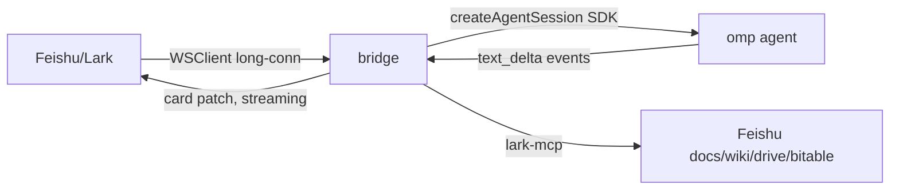

# feishu-omp-bridge

A full-featured **Feishu/Lark channel** for the omp (Oh My Pi) terminal agent —
aligned with [OpenClaw's `@openclaw/feishu` plugin](https://docs.openclaw.ai/channels/feishu)
and [Hermes Agent's messaging gateway](https://hermes-agent.nousresearch.com/docs/user-guide/messaging).

DM or @mention a Feishu bot → it drives an omp session → the agent streams its
reply back into the chat. Each chat (or group scope) gets a persistent omp session.



## Feature matrix (aligned with OpenClaw / Hermes)

| Capability | Status |
|---|---|
| Bot DMs + group chats | ✅ |
| Streaming card replies | ✅ |
| Receive images → omp ImageAttachment | ✅ |
| Send images / files back | ✅ |
| `dmPolicy`: allowlist / pairing / open | ✅ |
| `groupPolicy`: open / allowlist / disabled + requireMention | ✅ |
| Per-group overrides + sender allowlists | ✅ |
| `groupSessionScope`: group / group_sender / group_topic / group_topic_sender | ✅ |
| Admin/user command tier split | ✅ |
| Slash commands: `/help /whoami /status /reset /model /sessions /resume` | ✅ |
| Per-chat persistent `/model` override | ✅ |
| Feishu workspace tools (doc/wiki/drive/bitable/chat via lark-mcp) | ✅ |
| Delivery ledger (at-least-once redelivery after crash) | ✅ |
| Typing indicator (reaction) + bot-loop protection | ✅ |
| QR onboarding (`registerApp`) | ✅ |
| launchd service install | ✅ |

## Architecture

| File | Responsibility |
|---|---|
| `src/index.ts` | Main bridge: WSClient inbound → access → commands/media → omp → streamed card |
| `src/config-loader.ts` + `config-types.ts` | JSON5 config: defaults merge, validation, path resolution |
| `src/access.ts` | DM/group policies, pairing codes, admin/user tiers |
| `src/media.ts` | Image/file download+upload, typing reactions |
| `src/omp.ts` | omp `createAgentSession` + resume + image prompts + model overrides |
| `src/commands.ts` | Slash-command registry + tier-gated router |
| `src/scope.ts` | groupSessionScope keying + bot-loop detection |
| `src/feishu-tools.ts` | lark-mcp preset mapping + scope guidance |
| `src/ledger.ts` | at-least-once delivery ledger |
| `src/store.ts` | SQLite: chat→session map + per-chat model overrides |
| `src/service.ts` | launchd plist generator + install/uninstall |
| `src/onboard.ts` | QR onboarding (`registerApp`) |

## Quick start

```bash
bun install                                   # deps (China: --registry=npmmirror)
cp config.example.json5 feishu-bridge.json5   # then edit appId/appSecret/allowFrom
bun run register-app                          # OR scan a QR to auto-create a Feishu app
bun run start                                 # run in foreground
bun run service:install                       # OR install as a launchd service
```

Onboarding writes `appId`/`appSecret` into `.env` (a fallback credential source).
The JSON5 config takes precedence; `.env` fills only missing fields.

## Configuration (`feishu-bridge.json5`)

See `config.example.json5` for the full annotated schema. Key sections:

- **Access control** — `dmPolicy`, `allowFrom`, `groupPolicy`, `groupAllowFrom`,
  `requireMention`, `groups.<chat_id>` overrides.
- **Sessions** — `groupSessionScope`, `replyInThread`, `ompCwd`, `ompModel`,
  `channelOverrides`.
- **Rendering** — `renderMode`, `streaming.{mode,chunkMode}`, `textChunkLimit`,
  `mediaMaxMb`, `typingIndicator`, `resolveSenderNames`.
- **Reliability** — `streamIntervalMs`, `deliveryLedger`, `deliveryLedgerPath`.
- **Feishu tools** — `tools.{doc,chat,wiki,drive,perm,scopes,bitable}`.
- **Multi-account** — `accounts.<id>` (inherits top-level, deep-merges).
- **Pairing** — `pairingTtlSeconds`, `dataDir`.

Environment fallbacks (`.env`): `FEISHU_APP_ID`, `FEISHU_APP_SECRET`,
`FEISHU_ALLOWED_OPEN_IDS`, `OMP_CWD`, `OMP_MODEL`, `FEISHU_LARK_INTERNATIONAL`.

## Feishu workspace tools

The bridge registers the official [`@larksuiteoapi/lark-mcp`](https://github.com/larksuite/lark-openapi-mcp)
MCP server with omp sessions, gated by `tools.*` flags. Each family needs app scopes:

| Family | Preset | Scopes |
|---|---|---|
| doc / wiki / drive | `preset.doc.default` | `docx:document`, `wiki:wiki`, `drive:drive` |
| bitable | `preset.base.default` | `bitable:app` |
| chat | `preset.im.default` | `im:chat`, `im:message` |
| perm | (off by default) | `drive:permission` |

Grant these in the Feishu app console for the families you enable.

## Slash commands

```
/help          available commands (tier-aware)
/whoami        your open_id, tier, command access
/status        domain, ompCwd, current model, policies
/reset         drop this chat's omp session
/model [name]  show or (admin) set the model for this chat
/sessions      (admin) list named sessions
/resume <name>(admin) resume a named session
```

Feishu has no native slash menus — send these as plain text.

## Security

- `autoApprove: true` — a headless bridge auto-approves omp tool calls. Keep
  `allowFrom` / `dmPolicy` locked to yourself.
- Bot-to-bot messages are ignored unless `allowBots: true`.
- Treat inbound text as untrusted input.

## Operating

```bash
bun run start                # foreground
bun run service:install      # launchd (starts at login, restarts on crash)
bun run service:uninstall
tail -f bridge.stderr.log    # logs
```

## Notes

- `replyInThread` and rich `post`/`audio`/`video` inbound types are scaffolded
  but not fully wired — text/image/file are the battle-tested paths.
- `/sessions` and `/resume` return empty until named-session bookkeeping lands;
  the registry is in place so they activate without API churn.
